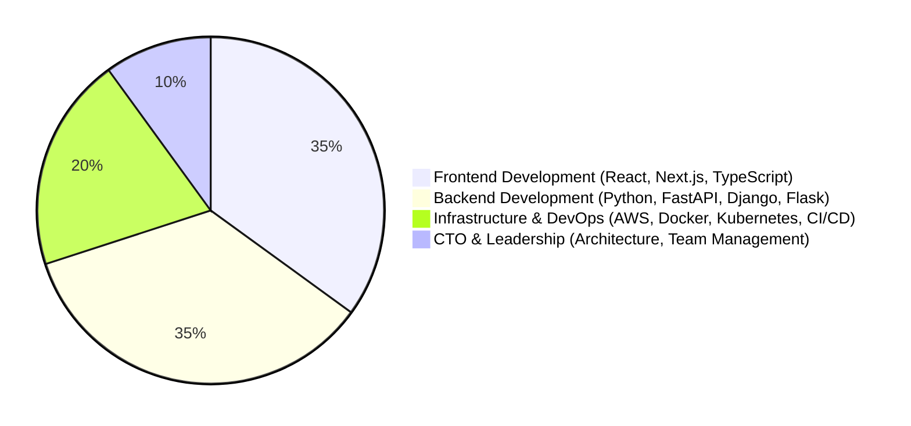

# Nicolás Guglielmi Manent  
**Senior Frontend React - Next.js @ Opna**  

📧 nicolas.guglielmi@gmail.com  
📞 +34 662273662  
🔗 [LinkedIn](https://www.linkedin.com/in/nicolasguglielmi/)  
📍 Cervelló, Barcelona, Spain  

---

## 🏆 Summary  
Passionate about software development from a young age, I have dedicated my career to building **scalable, efficient, and well-architected solutions**. With extensive experience in **web development, infrastructure, and software architecture**, I have worked with renowned companies and led technical teams as **CTO**.  

I specialize in **problem-solving, system optimization, and software scalability**, always balancing performance with **clean, maintainable code**. My background includes close collaboration with designers, allowing me to integrate functionality with aesthetics seamlessly. While I’ve held leadership roles, my passion remains hands-on **development**, tackling technical challenges at the **code and infrastructure levels**.  

🔹 **Key Skills:**  
`Software Architecture` | `Web Development` | `Infrastructure Optimization` | `Scalable Systems` | `Team Leadership` | `Problem Solving`  

---

## 🚀 Experience  
### Experience Breakdown

### **Senior Frontend Developer** | Opna (Formerly SALT)  
📅 10/2022 - Present | 🌍 Remote  

As a **Senior Frontend Developer**, I specialize in designing and developing **high-performance web applications** using **React and Next.js**.  

**🔹 Key Responsibilities:**  
- **Frontend Development:** Architecting and implementing responsive, interactive, and optimized interfaces.  
- **Backend Development:** Building and maintaining **APIs and microservices with FastAPI (Python)**.  
- **Infrastructure Management:** Handling **cloud environments, CI/CD pipelines, and system monitoring**.  
- **Performance Optimization:** Identifying and resolving bottlenecks in **frontend and backend systems**.  

---

### **High-Traffic Game Development in React & Python**  
📅 2022 - Present  

Designed and developed **interactive games** using **React**, handling **over 10 million requests per month** while ensuring performance, scalability, and an engaging user experience.  

**🔹 Key Achievements:**  
✅ Managed **300,000+ API calls daily** for seamless game integration.  
✅ Reduced load times by **25%** by optimizing React components and backend architecture.  
✅ Led **12 high-traffic gaming projects**, each exceeding **50,000 daily users**.  

---

### **Freelance Full-Stack Developer | Python, JavaScript & Cloud Solutions**  
📅 01/2008 - Present | 🌍 Remote  

As a **freelance full-stack developer**, I build **scalable, high-performance applications** tailored to business needs.  

🔹 **Tech Stack & Expertise:**  
- **Frontend Development:** React, React Native, Next.js  
- **Backend Development:** Django, FastAPI, Flask (Python)  
- **Cloud & Infrastructure:** AWS (EC2, Lambda, S3, RDS), CI/CD pipelines, Docker, Kubernetes  
- **Mobile Development:** React Native  
- **Performance Optimization:** Speed, security, and efficiency improvements  

🚀 **Let’s build something great together!**  

---

### **Frontend Software Developer – La Vanguardia Games**  
📅 09/2021 - 12/2021 | 🌍 Remote  

Developed and implemented the **frontend architecture** for **interactive games** in **La Vanguardia**, designed as a **reusable library**.  

**🔹 Key Contributions:**  
- Built the entire **frontend** using **React and TypeScript**.  
- Designed a **reusable library** for seamless integration into the newspaper’s system.  
- **Optimized API communication** for high-speed game performance.  
- **Containerized development** using **Docker & Docker Compose**.  

---

### **CTO & Developer | MyDocumenta**  
📅 12/2016 - 11/2021 | 📍 Barcelona  

Led **full-stack development, cloud infrastructure, and DevOps**, including external applications like **Improvisa**.  

🔹 **Key Technologies:** React, FastAPI, Django, Flask, AWS (Lambda, API Gateway, EC2, Elastic Beanstalk), Docker, CI/CD.  

---

### **CTO & Developer | Psychopharmacology Institute**  
📅 10/2018 - 05/2020 | 📍 London, UK  

Led **software architecture, cloud strategy, and development**, ensuring scalable and efficient solutions.  

🔹 **Tech Stack:** React, Next.js, Django, FastAPI, Flask, AWS, Docker, Kubernetes.  

---

## 🎯 Achievements  

### **High-Traffic Game Development**  
- Designed and developed interactive games handling **over 10 million requests per month**.  
- Ensured **seamless API communication** and **optimized frontend performance**.  

### **WordPress Plugin Success**  
- Developed an **open-source WordPress plugin** with **4,500+ downloads**.  

---

## 🛠️ Technologies & Tools  

**Programming Languages:**  
`JavaScript` | `TypeScript` | `Python` | `GoLang` | `Node.js` | `PHP`  

**Frontend:**  
`React` | `React Native` | `Next.js` | `TypeScript` | `CSS/SCSS`  

**Backend & APIs:**  
`FastAPI` | `Django` | `Flask` | `Node.js` | `GraphQL` | `REST APIs`  

**Cloud & Infrastructure:**  
`AWS` (Lambda, API Gateway, EC2, S3, RDS, Elastic Beanstalk) | `Docker` | `Kubernetes` | `CI/CD Pipelines`  

---

## 📢 Contact  

📧 **Email:** nicolas.guglielmi@gmail.com  
📞 **Phone:** +34 662273662  
🔗 **LinkedIn:** [linkedin.com/in/nicolasguglielmi](https://www.linkedin.com/in/nicolasguglielmi/)  
📍 **Location:** Cervelló, Barcelona, Spain  

---

🚀 **Passionate about building scalable, high-performance applications with modern technologies.**  
